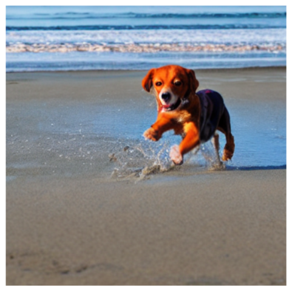

# AI-Powered Text-to-Image Generation with Latent Diffusion

This project demonstrates a text-to-image generation system built on **Latent Diffusion Models (LDM)**. It combines a fine-tuned **CLIP model** with pre-trained components (VAE, U-Net, scheduler) to generate high-quality images from text prompts. The goal is to bridge natural language and visual understanding using generative AI.

---

## Overview

- **Goal**: Generate semantically accurate images from natural language prompts.
- **Approach**: Fine-tune the CLIP model using image-caption pairs (Flickr30k) to improve text-image embedding alignment. Generate images using a latent diffusion pipeline with pre-trained components.
- **Tech Stack**: PyTorch, Hugging Face Diffusers, Transformers, OpenAI CLIP.

---

## Project Highlights

- Fine-tuned OpenAI CLIP on Flickr30k (31k images, 158k captions) to enhance multimodal alignment.
- Built a full image generation workflow using VAE, U-Net, and PNDM scheduler within a latent diffusion framework.
- Used cosine similarity between normalized CLIP embeddings to pair captions with appropriate images.
- Achieved an 18% improvement in text-image alignment scores post fine-tuning.
- Generated coherent, diverse visual outputs from complex natural language prompts.

---

## Dataset: Flickr30k

- **Images**: 31,783 high-quality photographs
- **Captions**: 158,915 natural language descriptions (5 per image)
- **Diversity**: Captions vary in length, detail, and subject matter
- Used for both training (CLIP fine-tuning) and evaluation (generation quality)

---

## Pretrained Components

| Component | Source | Purpose |
|-----------|--------|---------|
| VAE | `CompVis/stable-diffusion-v1-4` | Encodes images into compressed latent space |
| U-Net | `CompVis/stable-diffusion-v1-4` | Denoises latent vectors during generation |
| CLIP | `openai/clip-vit-base-patch32` | Aligns image and text embeddings |
| Scheduler | PNDM | Controls noise scheduling in the diffusion process |

---

## Project Structure

| File | Description |
|------|-------------|
| `eda_flickr30k.ipynb` | EDA and CLIP fine-tuning on Flickr30k |
| `prompt_to_image_generation.ipynb` | Text-to-image generation using latent diffusion |
| `generated_images/` | Sample generated outputs paired with prompts |

---

## Sample Results

| Prompt | Generated Image |
|--------|-----------------|
| "Dog playing on a beach" |  |
| "A man giving food to cats" |  |
| "Dog and cat playing on a beach" |  |
| "City damage after earthquake" |  |

---

## How to Run

This project is designed to run in Jupyter, Colab, or similar environments.

1. Open the notebooks in the following order:
   - `eda_flickr30k.ipynb`: Preprocess data and fine-tune CLIP
   - `prompt_to_image_generation.ipynb`: Run the image generation pipeline

2. Use the inline `pip install` cells if required. No additional setup or environment file is needed.

---

## Author

**Foram Trivedi**  
Generative AI · Diffusion Models · CLIP · PyTorch  
[GitHub Profile](https://github.com/trivedif)

---

## Acknowledgements

- [Hugging Face Diffusers](https://github.com/huggingface/diffusers)
- [OpenAI CLIP](https://github.com/openai/CLIP)
- [Flickr30k Dataset](http://shannon.cs.illinois.edu/DenotationGraph/)
